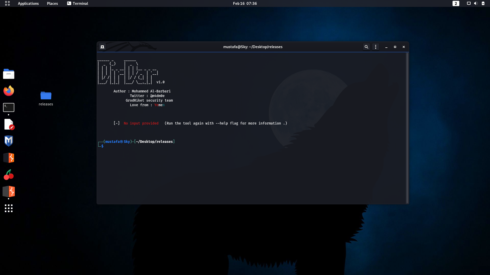
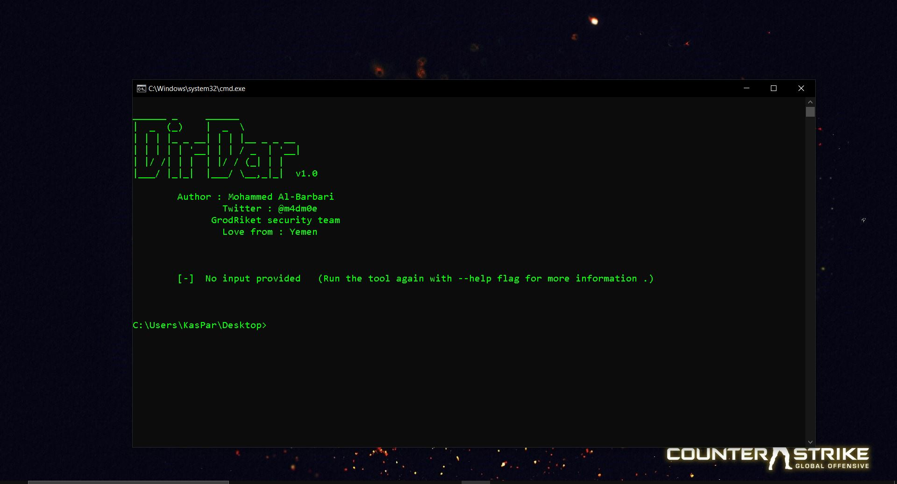
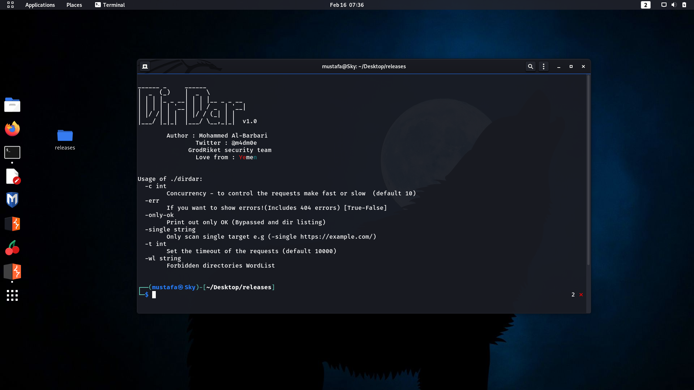
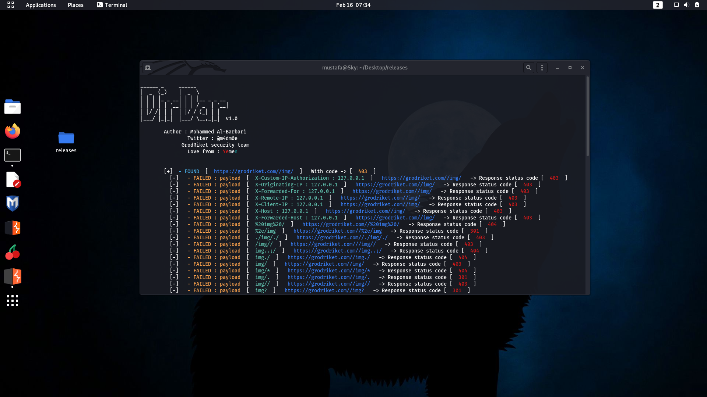
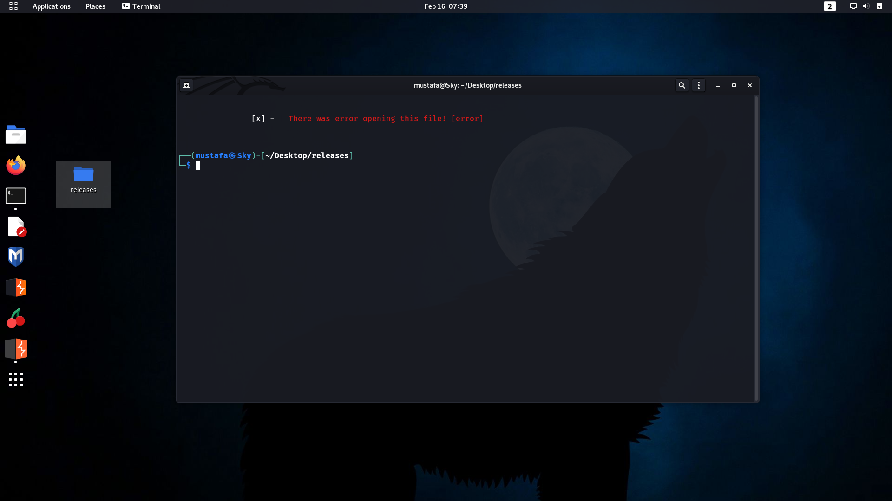

# DirDar v1.0

<p align="center">
  <b>🏴‍☠️ bypass forbidden directories - find and identify dir listing - you can use it as directory brute-forcer as well</b><br>
    <sub>
  </sub>
  <br>
  <!--Tweet button-->
  <a href="https://twitter.com/intent/tweet?url=https%3A%2F%2Fgithub.com%2Fm4dm0e%2Fdirdar&text=DirDar%20is%20a%20tool%20that%20searches%20for%20(403-Forbidden)%20directories%20to%20break%20it%20and%20get%20dir%20listing%20on%20it." target="_blank">Share on Twitter!
  </a>
  <br><br />
  <a href="https://twitter.com/m4dm0e"></a>
<a href="https://www.linkedin.com/in/Albarbari/"></a>
<a href="https://moe.grodriket.com/"></a>
<br />
</p>
  
## Install

Run this command if you have Go installed and configured.

```
go get -u github.com/m4dm0e/dirdar
```

Or you can [download a release](https://github.com/m4dm0e/dirdar/releases).
To make it easier to execute you can put the binary in your `$PATH`.

## Tool screen:
* Linux


  </a>


* Windows

  </a>
  
  
## Help&Flags

```
  -c int
    	Concurrency - to control the requests make fast or slow  (default 10)
  -err
    	If you want to show errors!(Includes 404 errors) [True-False]
  -only-ok
    	Print out only OK (Bypassed and dir listing) 
  -single string
    	Only scan single target e.g (-single https://example.com/)
  -t int
    	Set the timeout of the requests (default 10000)
  -wl string
    	Forbidden directories WordList

```

* Screenshot

  </a>


## Other screenshots

  </a>

  </a>


